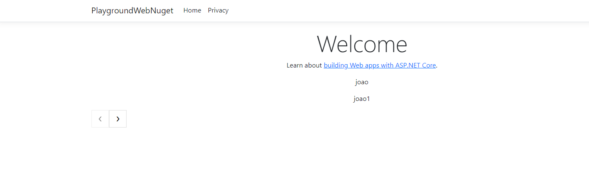

# Short clean linq extensions

Sce is a .NET Nuget extensions to make things easier.

## Installation

.NET CLI

```bash
dotnet add package ShortCleanLinqExtensions --version 1.0.6
```

Package Manager Console

```bash
NuGet\Install-Package ShortCleanLinqExtensions -Version 1.0.6
```

## Usage

```csharp
using ShortCleanLinqExtensions.src.Extensions;

# Title
"ula leila".Title(); 
// Output: Ula Leila 

# Slug
"ula leila".Stug();
// Output: ula-leila


# Mask
"ula leila".Mask("*", 4);
// Output: ula *****

# Snake Case
"UlaLeila".Snake();
// Output: ula_leila

# Is Json
"[1,2,3]".IsJson();
// Output: true

# List To Json
var list = new List<string>() { "1", "2", "3" };
list.ToJson();
// Output: ["1","2","3"]

# List Collapse
var listC1 = new List<int>() { 4, 5, 6, 7 };
var listC2 = new List<int>() { 4, 5, 6, 7 };

var manyList = new List<List<int>>() { listC1, listC2 };
var listCollapsed = manyList
    .Collapse()
    .ToList();
Console.WriteLine("Collapse => " + listCollapsed.ToJson());
// Output: [4,5,6,7,4,5,6,7]


# Paginate API
var list = new List<string>() { "1", "2", "3" };
var listPagineted = list
.AsQueryable()
.Paginate(1, 10);
// Output: {"Page":1,"Limit":10,"FirstPage":null,"LastPage":null,"Total":3,"NextPage":null,"PreviousPage":null,"Data":["1","2","3"]}


# Paginate MVC or Razor Pages
   public class IndexModel : PageModel
    {
        private readonly ILogger<IndexModel> _logger;
        public readonly List<string> _dataSet;
        private readonly IHttpContextAccessor _httpContextAccessor;
        public PagedResponse<List<string>> Items { get; set; }
        public IndexModel(ILogger<IndexModel> logger, IHttpContextAccessor httpContextAccessor)
        {
            _logger = logger;
            _dataSet = new List<string>()
            {
                "joao",
                "joao1",
                "joao2",
                "joao3",
                "joao4",
                "joao5",
                "joao6",
                "joao7",
            };
            _httpContextAccessor = httpContextAccessor;
        }

        public void OnGet([FromQuery] int page = 1, [FromQuery] int limit = 2)
        {       
             Items = _dataSet
                .AsQueryable()
                .Paginate(page, limit, Request, _httpContextAccessor);
        }
    }

    ...Index.cshtml

       @Html.Raw(Model.Items.Links())

       //output:
```


```csharp

# When
bool condition = true;
var newListFiltered = listC1
    .AsQueryable()
    .When(condition, l => l.Equals(4))
    .ToList();
// Output: [4]

# WhenInclude
bool condition = true;
var newListFiltered = listC1
    .AsQueryable()
    .WhenInclude(condition, l => l.NavigationProperty.Property)
    .Select(l => l.NavigationProperty.Property)
    .ToArray();
// Output: [Property, Property]

params = Support.DateTime.Type.Machine || Support.DateTime.Type.UTC (default)
Now(params)

//Output: 01/21/2024 18:30:24

# Diff
List<int> firstList = new List<int>() { 1, 2, 3, 4, 5 };
List<int> secondList = new List<int>() { 2, 4, 6, 8 };
IEnumerable<int> diff = firstList.Diff(secondList);

// Output: String.Join(',', diff) => 1,3,5
```

```csharp

# Automatic dependency injection scanner 

## You interfaces you need add extend the (IScopedService, ISingletonService or ISingletonService) 

Sample: 

    public interface ITest : IScopedService
    {
        decimal Calculate(int itemA, int itemB);
    } 
    
    ...
    
    public class Test : ITest
    {
        public decimal Calculate(int itemA, int itemB) => itemA + itemB;
    }


## You Have two option you can add with nuget or native
Settings: 

1 - builder.Services.AddDIScannerIOC(); // native
or 
2 - builder.Services.AddDIScannerIOCWithScrutor(); // with nuget scrutor

```


## Contributing

Pull requests are welcome. For major changes, please open an issue first
to discuss what you would like to change.

Please make sure to update tests as appropriate.

## License

[MIT](https://choosealicense.com/licenses/mit/)